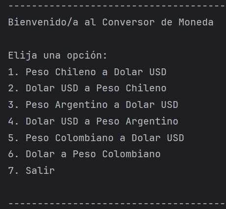

# Conversor de monedas
Challenge Conversor de Monedas - Programa ONE Oracle Next Education

## Descripción
En este desafio había que crear con Java un conversor de monedas internacionales utilizando el "EXCHANGE Rate API".

Con un menú de diferentes opciones, donde cada opcion realice una conversión diferente.

Menú muy intuitivo y fácil de usar.

Dependiendo de la opción elegida se realizará la conversión final.

## Herramientas utilizadas
- IDE: IntelliJ IDEA
- Versión de Java: 17.0.6
- Librería: Gson 2.10.1
- API: https://www.exchangerate-api.com/

## Autor
**Victor Lara**
